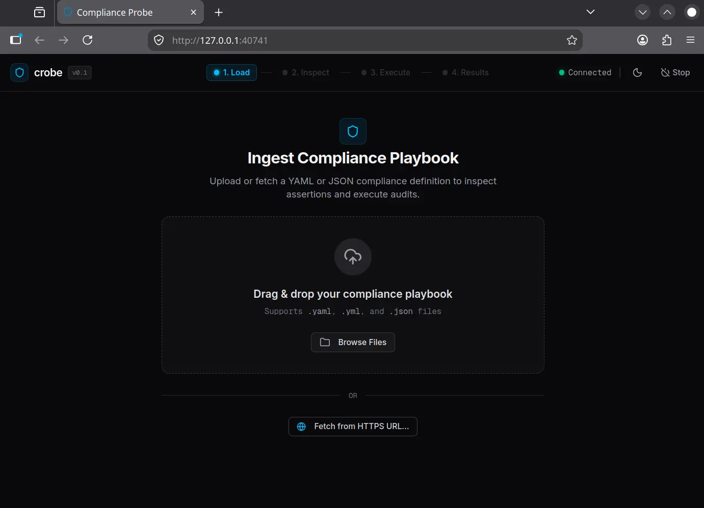

# `crobe`: Compliance Probe 🛡️

[](https://github.com/benedictjohannes/crobe/actions) [](https://benedictjohannes.github.io/crobe/coverage.html) [](https://pkg.go.dev/github.com/benedictjohannes/crobe) [](https://www.npmjs.com/package/crobe-sdk) [](https://github.com/benedictjohannes/crobe/blob/master/LICENSE)

**`crobe`** is a cross-platform security compliance reporting agent. It executes a series of automated checks defined in a YAML "playbook" to verify system integrity, security configurations, and hardware state.

Whether you are auditing a desktop for security standards or monitoring server health, `crobe` provides a flexible, scriptable, and reproducible way to generate detailed compliance reports.



## ✨ Key Features

-   **🖥️ Embedded Local Web UI**: Self-contained web interface (Pure Go + Svelte 5) with drag-and-drop playbook loading, real-time live execution streaming, interactive log console, compliance scorecard, and multi-format report exports (`.zip`, `.tar.gz`, Markdown).
-   **🔍 Automated Compliance Checks**: Group assertions into logical sections (e.g., OS Integrity, IAM, Data Protection).
-   **🔒 Privilege Elevation**: Seamlessly run checks requiring root or administrator privileges via secure IPC workers with single-prompt GUI/terminal fallbacks (`sudo`/`pkexec` on Linux, `osascript`/`sudo` on macOS, UAC on Windows).
-   **🚀 Multi-Platform support**: Native binaries for Linux, Windows, and macOS (Intel & ARM).
-   **📊 Comprehensive Reporting**: Generates reports in:
    -   **Markdown**: Human-readable summary for documentation.
    -   **JSON**: Machine-readable data for integration with other tools.
    -   **Detailed Logs**: Full execution trace for debugging.
-   **📥 Data Gathering**: Extract information from command outputs (via Regex or JS) and reuse it in subsequent checks within the same assertion.
-   **✅ Schema Validation**: Built-in JSON schema generation for IDE autocompletion.
-   **🌐 Remote Capabilities**: [Integrate playbook and compliance result submissions remotely](#remote-features).
-   **📜 JS Scripting & Logic**: Dynamic script generation and output evaluation using an embedded JavaScript engine ([Goja](https://github.com/dop251/goja)).
    -   **TS Support**: Write complex logic in separate `.js` or `.ts` files and "bake" them into a single portable playbook using the [builder tool](#builder-tool).
    -   **Type Definitions**: The [TypeScript definitions](./typescript-sdk) for playbook development and report consumption are available (via `npm install crobe-sdk`).

## 🎯 Use Cases

-   **🌍 Adaptive Fleet Audits**: Run compliance checks across Linux, Windows, and macOS using a single **"Universal Playbook"** that adapts logic at runtime via JavaScript.
-   **🛡️ Dynamic Security Chaining**: Extract data (like current user or PID) in one step and use it to drive subsequent commands within the same assertion.
-   **🔐 Privacy-Aware Secret Validation**: Audit sensitive configurations for keys or PII without leaking them. Extract values for internal logic while explicitly excluding them from reports.
-   **⚡ Elevated System Auditing**: Safely audit firewall rules, disk encryption, or protected logs requiring administrator/root rights without running the entire agent as root.
-   **📈 Weighted Compliance Scoring**: Assign scores to assertions to generate a numerical "Security Health" grade.
-   **🛠️ Pre-Flight Environment Checks**: Verify system integrity before deploying applications or onboarding new developer machines.

## 📦 Installation

Download the binary for your platform from the [releases](https://github.com/benedictjohannes/crobe/releases) page:

-   `crobe-linux`
-   `crobe-windows.exe`
-   `crobe-mac-arm`
-   `crobe-mac-intel`

## 🚀 Quick Start

### 🖥️ Interactive Web UI (Desktop)

Double-click the binary or run without arguments in any desktop terminal:

```bash
./crobe
```

> **Tip:** You can also preload a playbook directly into the UI:
> ```bash
> ./crobe --ui my-security-audit.yaml
> ```

1. **Load**: Drag & drop a `.yaml`/`.json` playbook or fetch directly from an HTTPS URL.
2. **Inspect**: Review assertions, elevation requirements, and destination settings.
3. **Execute**: Live progress, real-time streaming logs, and single-prompt OS elevation handling.
4. **Export**: View compliance scorecard, instant Markdown preview, raw logs, or download full archive bundles (`.zip`, `.tar.gz`, `.tar.zst`).

---

### 💻 Headless & CI/CD Execution (Terminal & Servers)

For servers, automated scripts, or CI/CD pipelines, execute headlessly by supplying the playbook path:

```bash
./crobe my-security-audit.yaml
```

Reports are saved to the directory specified by `reportDestinationFolder` in the playbook, or overridden via the `--folder` flag (defaults to `reports/` with timestamped filenames like `260206-033831.report.md`).

## 🛠️ Configuration (playbook.yaml)

The playbook defines what to check, how to score results, and how to extract data.

For a comprehensive guide on all available features—including **weighted scoring**, **embedded JavaScript logic**, **data gathering**, and **cross-platform handling**—see:

👉 **[playbook.example.yaml](./playbook.example.yaml)**

### Remote Features

The probe can integrate with a central compliance hub:
- Fetch playbooks from remote HTTPS URL
- Submit signed results via HTTPS POST to central compliance hub

👉 **[Remote Playbook & Submission Guide](./docs/RemotePlaybookSubmission.md)**

## Builder Tool

The **Builder** (`crobe-builder`) is designed for compliance designers and developers to assist in creating and managing complex playbooks.

-   **Generate Schema**: Create a JSON schema for IDE autocompletion (VS Code, etc).
-   **Preprocessing Pipeline**: Use `funcFile` to externalize logic into TypeScript files, which are then transpiled and "baked" into a portable playbook for the agent.

For a detailed guide on using **TypeScript**, external scripts, and the preprocessing pipeline, see:

👉 **[Playbook Development Guide](./docs/PlaybookDevelopment.md)**

## 🏗️ Development and Building

The project is split into two packages under `cmd/` to separate the runtime agent from the developer tools.

### Prerequisites

- [Go](https://go.dev/dl/) 1.25+
- [Node.js](https://nodejs.org/) 24+ / [Bun](https://bun.sh/) (for building embedded frontend assets)

### Build Agent Binaries

The agent is located in `cmd/probe`. To build the embedded web assets and compile optimized binaries:

```bash
make build
```

Or build manually:
```bash
# 1. Build frontend assets
cd webui && npm install && npm run build && cd ..

# 2. Compile agent with embedded assets
go build -o crobe ./cmd/probe
```

### Build Builder Binaries

The builder is located in `cmd/builder`. It includes `esbuild` for TypeScript transpilation:

```bash
make build-builder
```

Or build manually:
```bash
go build -o crobe-builder ./cmd/builder
```

### Running Tests

```bash
# Unit & integration tests
make test

# Embedded Web UI end-to-end Playwright tests
make test-e2e-gui
```

## ⚖️ License

This project is licensed under the MIT License - see the [LICENSE](LICENSE) file for details.
